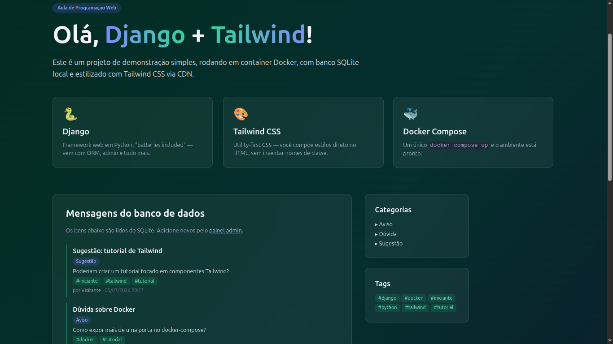
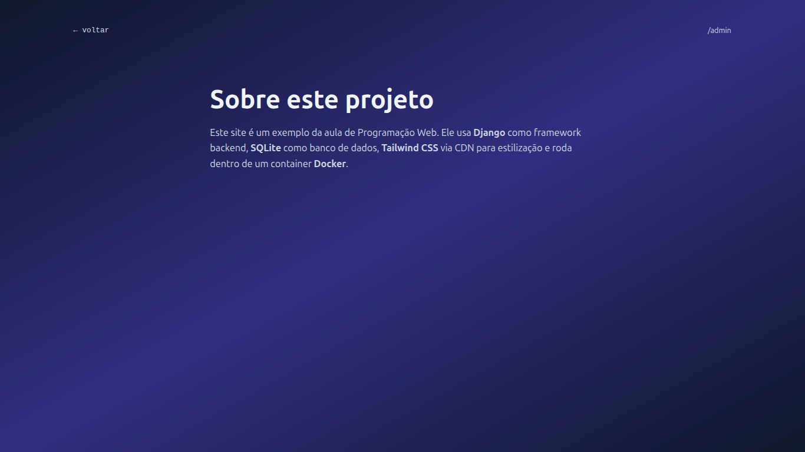

# Parte 4 — Relacionamento muitos-para-muitos (Tag ↔ Mensagem)

## Resultados obtidos

### Página inicial (`http://localhost:8000`)

A página principal agora exibe tags no formato `#tagname` abaixo do
conteúdo de cada mensagem, quando tags estão associadas.

### Página /sobre/ (`http://localhost:8000/sobre/`)

Página sobre mantida das partes anteriores.

### Painel administrativo (`http://localhost:8000/admin/`)

O admin agora exibe:
- Modelo `Tag` cadastrável com campo `nome`
- Formulário de `Mensagem` com campo `Tags` usando `filter_horizontal`
  (dois painéis lado a lado "disponíveis" / "escolhidas")
- Filtro lateral por tags

## Funcionalidades implementadas

- Modelo `Tag` (SlugField, nome único)
- Campo `tags` (ManyToManyField) em `Mensagem`
- `related_name="mensagens"` para acesso reverso `tag.mensagens.all()`
- Migration `0003_tag_mensagem_tags.py` (cria tabela de junção)
- Template exibe tags como badges `#nometag` quando presentes
- Admin com `filter_horizontal` para melhor usabilidade
- `list_filter` por tags no admin
