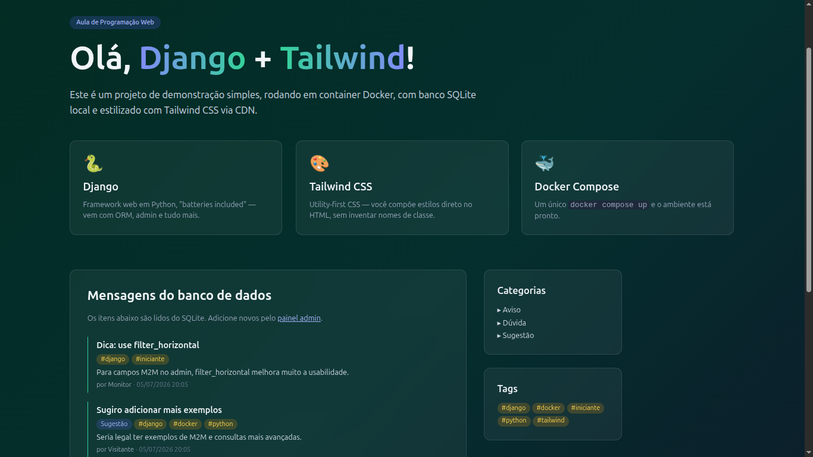
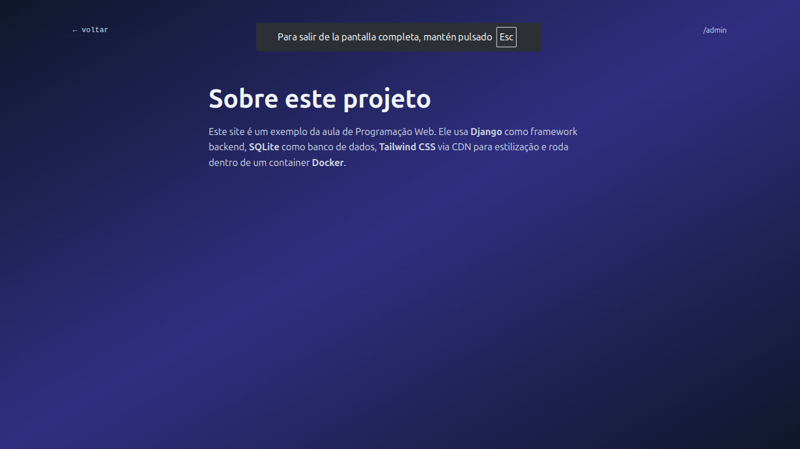
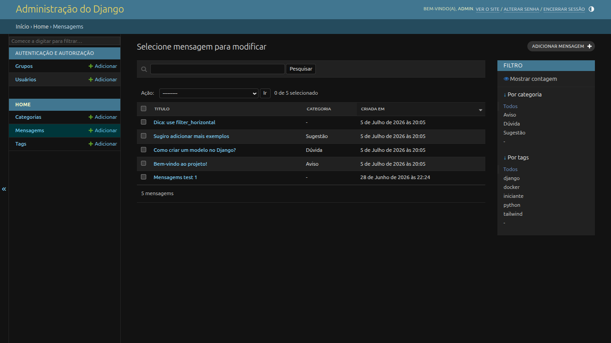

# Projeto Django + Tailwind — Modelos e Relacionamentos

## Modelos implementados

### `Mensagem`

| Campo      | Tipo                          | Descrição                    |
|------------|-------------------------------|------------------------------|
| `titulo`   | `CharField(120)`              | Título da mensagem           |
| `conteudo` | `TextField()`                 | Conteúdo da mensagem         |
| `autor`    | `CharField(80)`               | Nome do autor                |
| `categoria`| `ForeignKey(Categoria)`       | Relacionamento N:1           |
| `tags`     | `ManyToManyField(Tag)`        | Relacionamento N:N           |
| `criada_em`| `DateTimeField(auto_now_add)` | Data de criação              |

### `Categoria`

| Campo  | Tipo                       | Descrição               |
|--------|----------------------------|-------------------------|
| `nome` | `CharField(50, unique=True)` | Nome único da categoria |

**Relacionamento:** uma `Categoria` pode ter várias `Mensagem` (1:N).

### `Tag`

| Campo  | Tipo                       | Descrição          |
|--------|----------------------------|--------------------|
| `slug` | `SlugField(50, unique=True)` | Identificador único |

**Relacionamento:** uma `Tag` pode estar em várias `Mensagem` e vice-versa (N:N).

---

## Página inicial (`http://localhost:8000`)

A página lista todas as mensagens com:
- Selo de categoria (lilás) quando associada
- Tags (âmbar) com `#slug`
- Nome do autor e data de criação
- Sidebar à direita com listagem de **categorias** e **tags**

### Página /sobre/ (`http://localhost:8000/sobre/`)

Página estática mantida do roteiro anterior.

### Painel administrativo (`http://localhost:8000/admin/`)

- Modelo `Categoria` com cadastro e busca
- Modelo `Tag` com cadastro e busca
- Modelo `Mensagem` com:
  - Campo `Categoria` (dropdown)
  - Campo `Tags` (`filter_horizontal` para seleção múltipla)
  - Colunas `titulo`, `categoria`, `criada_em`
  - Filtro lateral por categoria e tags
  - Busca por título e conteúdo

---

## Funcionalidades implementadas

- Modelo `Categoria` (nome único) com FK em `Mensagem`
- `related_name="mensagens"` para acesso reverso `categoria.mensagens.all()`
- `on_delete=models.SET_NULL` para preservar mensagens ao apagar categoria
- Modelo `Tag` (slug único) com M2M em `Mensagem`
- `related_name="mensagens"` no M2M para acesso reverso `tag.mensagens.all()`
- Template exibe badge de categoria e tags por mensagem
- Sidebar com listagem de categorias e tags
- Admin com `list_filter` por categoria e tags
- `filter_horizontal` para seleção de tags no formulário
- Migrations: `0001_initial` (Mensagem), `0002_categoria_mensagem_categoria` (Categoria + FK), `0003_tag_mensagem_tags` (Tag + M2M)
