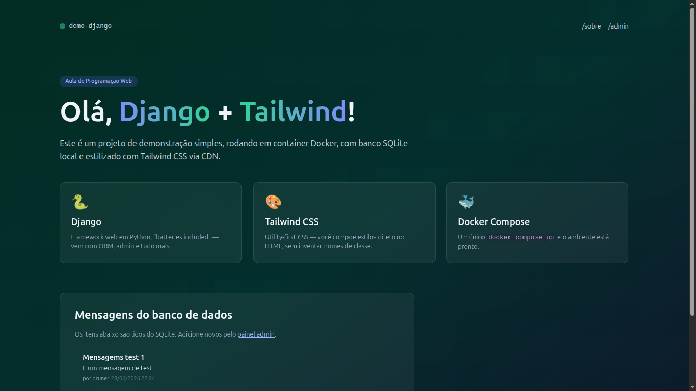
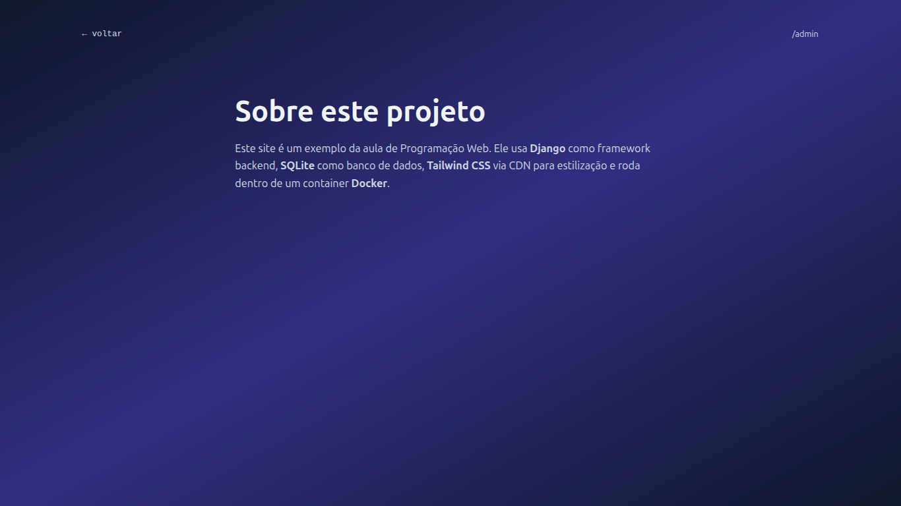
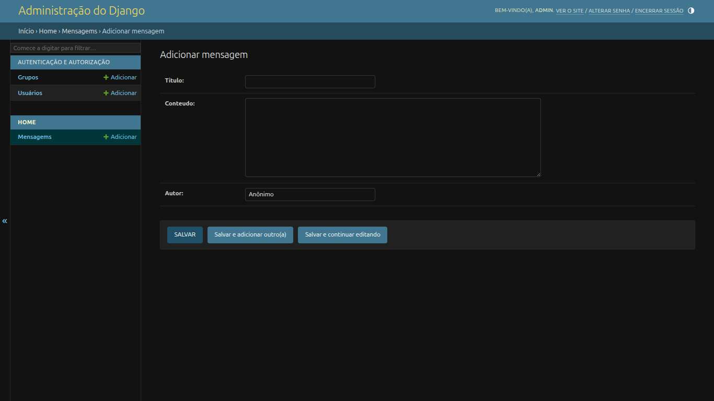

# Parte 2 — Adicionando campo `autor` e página `/sobre/`

## Resultados obtidos

### Página inicial (`http://localhost:8000`)

### Página /sobre/ (`http://localhost:8000/sobre/`)

### Painel administrativo (`http://localhost:8000/admin/`)

## Funcionalidades implementadas

- Campo `autor` adicionado ao model `Mensagem` (default: "Anônimo")
- Migration `0001_initial.py` gerada
- View `sobre` criada
- Rota `/sobre/` registrada
- Template `templates/home/sobre.html` criado
- Link `/sobre` no menu de navegação
- Gradiente do fundo alterado
