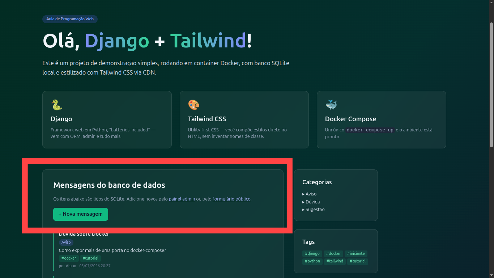
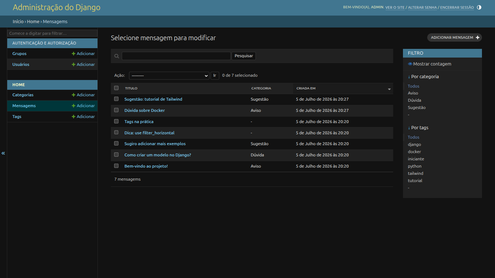

# Parte 5 — Formulário HTML e o ciclo CRUD com Django

## Resultados obtidos

### Página inicial (`http://localhost:8000`)

A página principal agora exibe um botão **+ Nova mensagem** e um link para o
formulário público, além da lista de mensagens com categorias e tags.

### Página /nova/ (`http://localhost:8000/nova/`)

Formulário público para cadastrar mensagens com tags no formato de texto livre
separado por vírgula. Usa `ModelForm` com validação automática e proteção CSRF.

### Página /sobre/ (`http://localhost:8000/sobre/`)

Página sobre mantida das partes anteriores.

### Painel administrativo (`http://localhost:8000/admin/`)

O admin continua funcionando normalmente para gerenciar mensagens, tags e categorias.

## Funcionalidades implementadas

- `MensagemForm` (`ModelForm`) em `home/forms.py` com campo de tags como texto livre
- View `nova_mensagem` que processa GET (mostra formulário) e POST (valida e salva)
- Criação automática de tags via `get_or_create` e `slugify`
- Padrão Post/Redirect/Get (PRG) com `redirect("index")`
- Template `home/nova.html` com `` e exibição de erros campo a campo
- Botão **+ Nova mensagem** e link na página inicial
