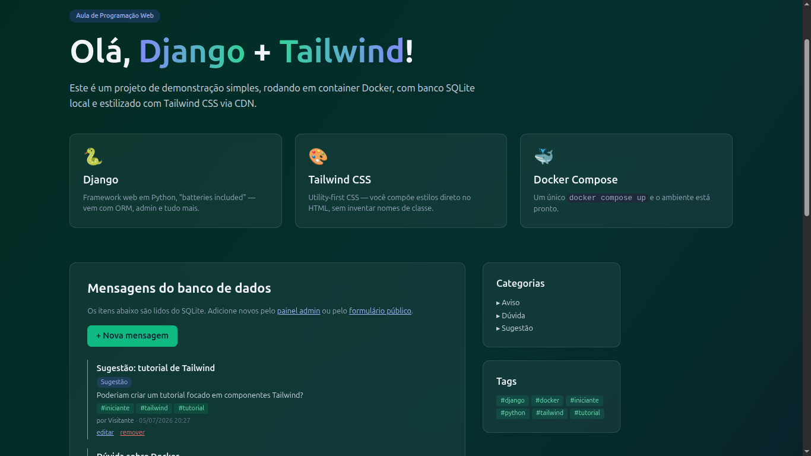
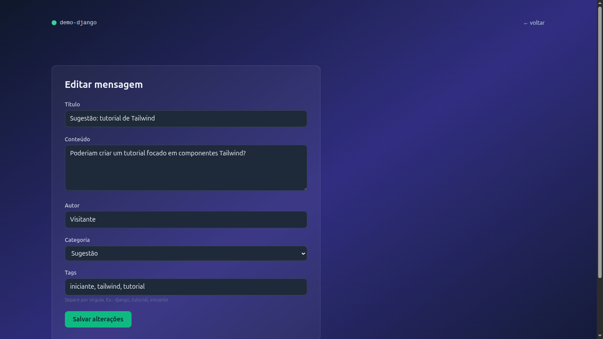
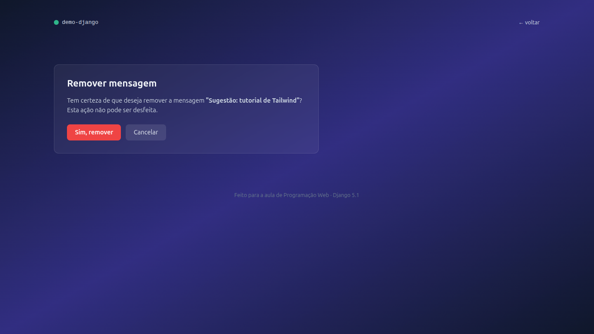
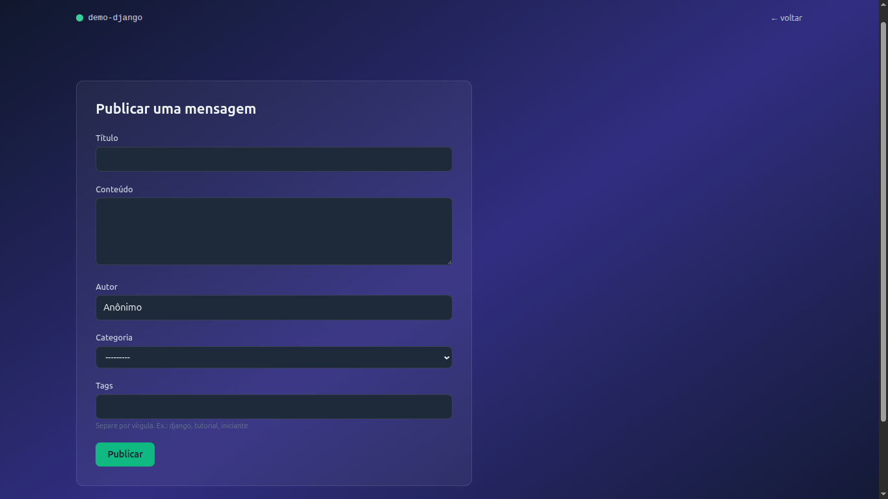

# Parte 6 — Editar e remover: finalizando o ciclo CRUD com Django

## Resultados obtidos

### Página inicial (`http://localhost:8000`)

A página principal agora exibe os links **editar** e **remover** ao lado de cada
mensagem, além de mensagens flash de feedback (sucesso ao publicar/editar/remover).

### Página /mensagens/:id/editar/ (`http://localhost:8000/mensagens/1/editar/`)

Formulário de edição pré-preenchido com os dados da mensagem, incluindo as tags
atuais no campo de texto. Reaproveita o mesmo `MensagemForm` da parte 5.

### Página /mensagens/:id/remover/ (`http://localhost:8000/mensagens/1/remover/`)

Página de confirmação antes de apagar. A remoção só ocorre via POST, nunca via GET.

### Página /nova/ (`http://localhost:8000/nova/`)

Formulário público mantido da parte 5, agora com feedback visual via flash messages.

## Funcionalidades implementadas

- Função `_aplicar_tags` extraída para reúso (DRY) entre criação e edição
- View `editar_mensagem` com `get_object_or_404` e `instance` do `ModelForm`
- View `remover_mensagem` com confirmação via POST
- Rotas parametrizadas com `<int:id>` para editar e remover
- Flash messages (`django.contrib.messages`) para feedback ao usuário
- Templates `home/editar.html` e `home/remover.html`
- Links **editar** e **remover** na lista da página inicial
- Ciclo CRUD completo sem abrir o painel admin
