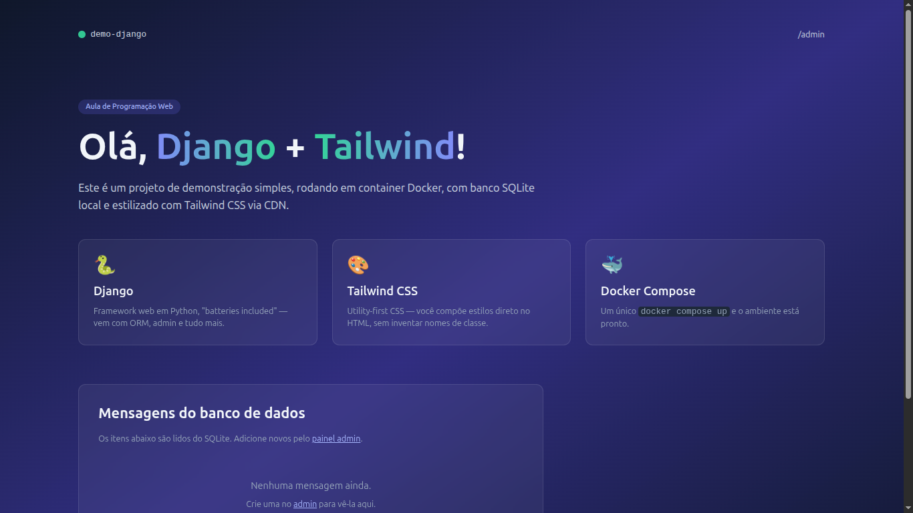
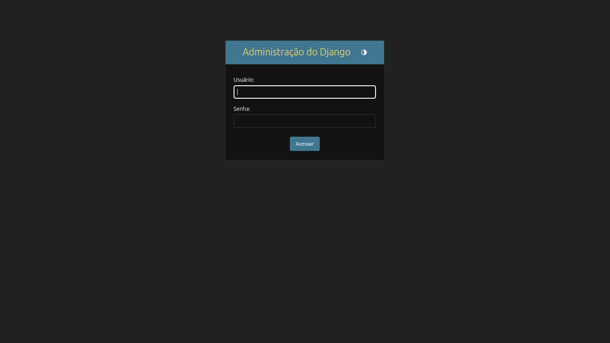

# Parte 1 — Estrutura inicial do Django + Tailwind + Docker

## Resultados obtidos

### Página inicial (`http://localhost:8000`)

### Painel administrativo (`http://localhost:8000/admin/`)

## Funcionalidades implementadas

- Projeto Django configurado com Docker
- Tailwind CSS via CDN
- Modelo `Mensagem` definido (titulo, conteudo, criada_em)
- View `index` que lista mensagens
- Admin básico registrado
- `/admin/` funcional
